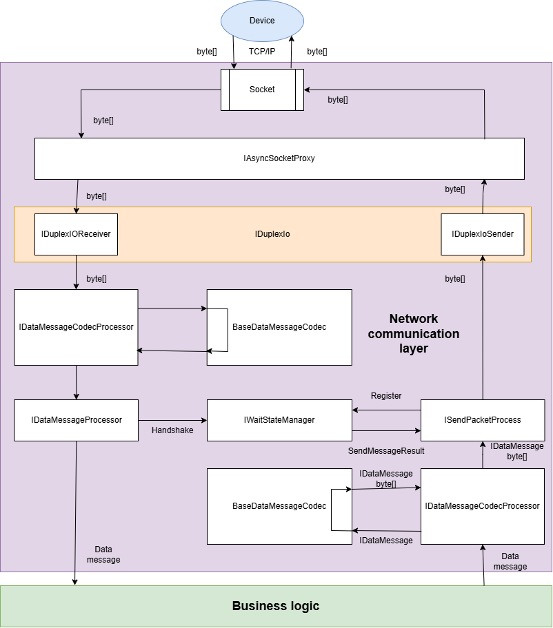
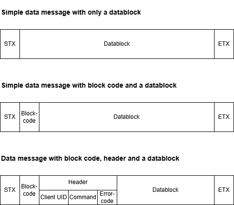

Bodoconsult.NetworkCommunication
==============

# What does the library

Bodoconsult.NetworkCommunication is a library with basic functionality for setting up a client server network communication based on TCP/IP and a self-defined low level byte message protocol. 

>	[Network communication overview](#network-communication-overview)

>	[Defining your device communication protocol](#defining-your-device-communication-protocol)

>	[Setting up messaging configuration: IDataMessagingConfig](#setting-up-messaging-configuration-idatamessagingconfig)

>	[Define message limiting bytes: DeviceCommunicationBasics](#define-message-limiting-bytes-devicecommunicationbasics)

>	[Implement a data message splitter splitting the incoming byte stream into potential messages: IDataMessageSplitter](#define-message-limiting-bytes-devicecommunicationbasics)

>	[Implement your data message types: IDataMessage](#implement-your-data-message-types-idatamessage)

>	[Implement a handshake validator: IHandshakeDataMessageValidator](#implement-a-handshake-validator-ihandshakedatamessagevalidator)

>	[Implement a data message validator: IDataMessageValidator](#implement-a-data-message-validator-idatamessagevalidator)

>	[Implement a message forwarder for received messages: IDataMessageProcessor](#implement-a-message-forwarder-for-received-messages-idatamessageprocessor)

>	[Implement the message codecs to decode and encode to byte array: BaseDataMessageCodec](#implement-the-message-codecs-to-decode-and-encode-to-byte-array-basedatamessagecodec)

>	[Datablock coding processor: IDataBlockCodingProcessor](#datablock-coding-processor-idatablockcodingprocessor)

>	[Implement your messaging package: IDataMessageProcessingPackage](#implement-your-messaging-package-idatamessageprocessingpackage)

>	[]()

>	[]()


>	[]()


>	[]()

>	[]()

# How to use the library

The source code contains NUnit test classes the following source code is extracted from. The samples below show the most helpful use cases for the library.

# Network communication overview

The basic idea of this library is sending message to the device as byte array and receiving messages from the device as byte array.

Internally all messages sent or received are a implementation of IDataMessage. There are two basic classes of messages: handshake messages and data messages. 

Handshake messages are used to sent acknowledgements to the client or wait for ackknowledgement from client for sent message.

Data messages are all other types of messages transporting all kinds of data as your protocol defines it.



To get all this working you have to set up your IDataMessageProcessingPackage implemetation carefully at the end and inject it to IDuplexIo via ctor injection via your IDataMessagingConfig instance. The following documentation shows how to do that step by step.

Don't be surprised you will find rarely byte arrays in the code. MS says byte arrays are too slow for network communication and invented an underlying low level data model which much more efficient regarding memory consumption and garbage collection. One of the new classes is Memory<byte> which is the underlying base of byte[].

# Defining your device communication protocol 

Defining a client server network communication protocol may contain for Bodoconsult.NetworkCommunication the following steps:

-	**Choosing message delimiters**: how to identify a message in a stream of bytes? Default is STX as message start and ETX char as message end.

-	**Data message** versus **handshake**: A data message contains any data your business logic will normally react on. A handshake is a simple answer to the other side: yes I got your data message (ACK) or not (NACK).

-	**The message content**: Defining the general content of a data message. Does a data message require a kind of header to be delivered always containg data like device ID or error codes or not?

-	**Datablock content**: This the important data delivered mainly to your business logic on both side of the communication. The prupose of your communication protocol defines the data structures of the datablocks needed for your protocol.



## Example 1: Simple Device Communication Protocol (SDCP)

For the usage in this documentation there will be implemented the following Simple Device Communication Protocol (SDCP).

The SDCP knows two basic types of messages:

- **Data messages** starting with STX char and ending with ETX char. Everything between STX and ETX is handled as datablock. It is up to you to define IDataBlockCodecs to give the transported bytes a meaning.
- **Handshakes**: a 1-byte-message with either ACK (message received successfully), NACK (message NOT received successfully) or CAN (device not ready) sent when a data message was received.

Each data message received will be answered by a handshake. 

The SDCP protocol is very simple but of limited usage in reality. The main drawback of SDCP are the missing identification of data message and its coresponding handshake

## Example 2: Enhanced Device Communication Protocol (EDCP)

Basically the EDCP protocol is same as SDCP protocol but the second byte of each message is a a block code. Client and server use different number ranges for block code. Let's say server uses block codes from 1 to 20 and client from 21 up to 40. If each party answers a received data message with a handshake it adds the block code received with the data nessage. So the sender of a data message can recognize the handshake received for the sent message clarly.

Another enhancement of EDCP protocl is byte 3 may contain a block code of a requesting data message. This enhancement makes it possible to implemenent data message requests answer by the other side by one or more data messages. If there is no block code for byte 3 delivered it means a data message sent without a request from the other side.

The repo Bodoconsult.NetworkCommunication contains a full implementation of EDCP protocol.

## Further potential enhancements

### Other message delimiters

Instead of STX and ETX you can use other message delimiter chars.

## Adding a general data message header

Instead of handling everything between STX and ETX as a datablock you can decide to start every message with a defined header containing a device ID, a request command, error codes, a device state and then after the header follows a data block with a certain purpose and its own definiton.

Adding a general data message header may reduce the implementation effort as you more the implementation from each data block code to the more general message code.


# Setting up messaging configuration: IDataMessagingConfig

``` csharp
/// <summary>
/// Config file for one the client-server network communication with one client device
/// </summary>
public class TestDataMessagingConfig: IDataMessagingConfigTcpIp
{

	/// <summary>
	/// A readable string for identitying the device used for logging
	/// </summary>
	public string LoggerId => "TestDevice";

	/// <summary>
	/// Current socket to use
	/// </summary>
	public ISocketProxy SocketProxy { get; set; }

	/// <summary>
	/// Data message procssing package
	/// </summary>
	public IDataMessageProcessingPackage DataMessageProcessingPackage { get; set; }

	/// <summary>
	/// Update data message processing package
	/// </summary>
	public UpdateDataMessageProcessingPackageDelegate UpdateDataMessageProcessingPackageDelegate { get; set; }

	/// <summary>
	/// Current general logger
	/// </summary>
	public IAppLoggerProxy AppLogger { get; set; }

	/// <summary>
	/// Current monitor logger
	/// </summary>
	public IAppLoggerProxy MonitorLogger { get; set; }

	/// <summary>
	/// A delegate for a method returning true if the communications is online or false if offline
	/// </summary>
	/// <returns>A delegate</returns>
	public CheckIfCommunicationIsOnlineDelegate CheckIfCommunicationIsOnlineDelegate { get; set; }

	/// <summary>
	/// A delegate for a method returning true if the device is or false if not
	/// </summary>
	/// <returns>true if the device is ready else false</returns>
	public CheckIfDeviceIsReadyDelegate CheckIfDeviceIsReadyDelegate { get; set; }

	/// <summary>
	/// Request a closing of the current communication connection from the business logic delegate
	/// </summary>
	public RaiseComDevCloseRequestDelegate RaiseComDevCloseRequestDelegate { get; set; }

	/// <summary>
	/// Delegate for handling central exception handling in <see cref="IDuplexIo"/> implementations.
	/// Set internally normally. Public implementation intended for testing purposes.
	/// </summary>
	public DuplexIoErrorHandlerDelegate DuplexIoErrorHandlerDelegate { get; set; }

	/// <summary>
	/// Message not sent delegate
	/// </summary>
	public RaiseDataMessageNotSentDelegate RaiseDataMessageNotSentDelegate { get; set; }

	/// <summary>
	/// Message sent delegate
	/// </summary>
	public RaiseDataMessageSentDelegate RaiseDataMessageSentDelegate { get; set; }

	/// <summary>
	/// Delegate fired on comm level if a data message has been received. Should be used in <see cref="ICommunicationHandler"/> impls to implement there handshake responses and then forward to the next layer
	/// </summary>
	public RaiseDataMessageReceivedDelegate RaiseCommLayerDataMessageReceivedDelegate { get; set; }

	/// <summary>
	/// Delegate raised on app level if data message was received
	/// </summary>
	public RaiseDataMessageReceivedDelegate RaiseAppLayerDataMessageReceivedDelegate { get; set; }

	/// <summary>
	/// Delegate raised if a device message does not fit the expectations (length, content, ...)
	/// </summary>
	public RaiseUnexpectedDataMessageReceivedDelegate RaiseUnexpectedDataMessageReceivedDelegate { get; set; }

	/// <summary>
	/// IP address of the device
	/// </summary>
	public string IpAddress { get; set; }

	/// <summary>
	/// Port to use for device communication
	/// </summary>
	public int Port { get; set; }
}
```

# Define message limiting bytes: DeviceCommunicationBasics

The static class DeviceCommunicationBasics holds default values used by the communication layer like timeouts, message start tokens and handshake start tokens. If the default settings are not fitting to your requirements, adjust the values as required.

``` csharp
/// <summary>
/// A holder class for basic device communication values
/// </summary>
public static class DeviceCommunicationBasics
{
	public static int MaxSendAttemptCount { get; set; } =  4;


	#region Command timeouts

	/// <summary>
	/// The default timeout in milliseconds
	/// </summary>
	public static int DefaultTimeout { get; set; } = 2000;

	/// <summary>
	/// Timeout for a PING sent to the tower
	/// </summary>
	public static int PingTimeout { get; set; } = 500;

	/// <summary>
	/// Timeout for waiting for a handshake like ACK, NACK or CAN
	/// </summary>
	public static int WaitForAckTimeout { get; set; } = 12000;

	#endregion

	#region Message tokens

	/// <summary>
	/// All tokens a message can start with
	/// </summary>
	public static List<byte> MessageStartTokens = new() {
		Ack,
		Can,
		Nack,
		Stx
	};

	/// <summary>
	/// All tokens a handshake message can start with
	/// </summary>
	public static List<byte> HandshakeMessageStartTokens = new() {
		Ack,
		Can,
		Nack
	};

	#endregion

	#region Constants

	public const byte Stx = 2;      // 0x02

	public const byte Etx = 3;      // 0x03

	public const byte Ack = 6;      // 0x06

	public const byte Nack = 21;    // 0x15

	public const byte Can = 24;     // 0x18

	public const byte NullByte = 0x0;

	#endregion
}
```

# Implement a data message splitter splitting the incoming byte stream into potential messages: IDataMessageSplitter

The following implementation of IDataMessageSplitter shows how the byte stream is splitted for the SDCP protocol. 

``` csharp
/// <summary>
/// Implementation for <see cref="IDataMessageSplitter"/> for SDCP protocol
/// </summary>
public class SdcpDataMessageSplitter : IDataMessageSplitter
{

    // Array pool is okay as shared instance here
    private static readonly ArrayPool<byte> ArrayPool = ArrayPool<byte>.Shared;

    /// <summary>
    /// Length of handshake messages
    /// </summary>
    protected int HandshakeLength = 1;

    /// <summary>
    /// Main method for TCP/IP message receiving: split the inbound byte stream in commands to process later
    /// </summary>
    /// <param name="buffer">Receiving buffer</param>
    /// <param name="command">The received command. May have a length of zero. Then no valid message was received so far</param>
    /// <returns>True if a command was successfuly extract from the buffer else false</returns>
    public virtual bool TryReadCommand(ref ReadOnlySequence<byte> buffer, out ReadOnlySequence<byte> command)
    {
        var result = TryReadCommandInternal(ref buffer, out command);

        // Check for nulls string the

        command = DataMessageHelper.CheckCommandForNullAtTheEnd(command);

        // Now copy the command if required
        if (command.Length <= 0)
        {
            return result;
        }
        var array = ArrayPool.Rent((int)command.Length);

        command.CopyTo(array);
        command = new ReadOnlySequence<byte>(array).Slice(0, command.Length);

        ArrayPool.Return(array);

        return result;
    }

    private bool TryReadCommandInternal(ref ReadOnlySequence<byte> buffer, out ReadOnlySequence<byte> command)
    {
        //Debug.Print($"TryReadCommand: {GetStringFromArray(buffer.ToArray())}");

        if (buffer.Length == 0)
        {
            command = default;
            return false;
        }

        var firstByte = buffer.Slice(0, 1).FirstSpan[0];

        // First byte is no message start: remove byte until next message start
        while (true)
        {
            // First byte is message start byte
            if (DeviceCommunicationBasics.MessageStartTokens.Contains(firstByte))
            {
                break;
            }

            // Remove byte if no message start byte
            buffer = buffer.Slice(1);

            if (buffer.Length == 0)
            {
                command = default;
                return false;
            }

            firstByte = buffer.Slice(0, 1).FirstSpan[0];

        }

        // No other
        if (buffer.Length < 1)
        {
            command = default;
            return false;
        }

        // First token is not a message start token
        if (!DeviceCommunicationBasics.MessageStartTokens.Contains(firstByte))
        {
            // Handshake with length 1?
            if (HandshakeLength == 1)
            {
                command = buffer.Slice(0, 1);
                buffer = buffer.Slice(1);
                return true;
            }

            // Check if there is a message start token following: if yes return invalid message
            for (var i = 1; i < HandshakeLength; i++)
            {
                var nextByte = buffer.Slice(i, 1).FirstSpan[0];
                if (!DeviceCommunicationBasics.MessageStartTokens.Contains(nextByte))
                {
                    continue;
                }
                command = buffer.Slice(0, i);
                buffer = buffer.Slice(i);
                return true;
            }


            command = default;
            return false;
        }

        // Handshake
        if (DeviceCommunicationBasics.HandshakeMessageStartTokens.Contains(firstByte))
        {

            var nextByte = buffer.Slice(1, 1).FirstSpan[0];

            if (!DeviceCommunicationBasics.MessageStartTokens.Contains(nextByte))
            {
                command = buffer.Slice(0, HandshakeLength);
                buffer = buffer.Slice(HandshakeLength);
                return true;
            }

            command = buffer.Slice(0, 1);
            buffer = buffer.Slice(1);
            return true;
        }

        // Data message
        if (firstByte != DeviceCommunicationBasics.Stx)
        {
            command = default;
            buffer = buffer.Slice(1);
            return false;
        }

        // Find end of message ETX
        int etxPos;
        var etxFound = false;
        for (etxPos = 0; etxPos < buffer.Length; etxPos++)
        {
            if (buffer.Slice(etxPos, 1).FirstSpan[0] == DeviceCommunicationBasics.Etx)
            {
                etxFound = true;
                break;
            }
        }

        if (!etxFound)
        {
            command = default;
            return false;
        }

        command = buffer.Slice(0, etxPos + 1);
        return true;
    }

    /// <summary>
    /// Compute the datablock length depending on firmware version
    /// </summary>
    /// <param name="messageBytes">Raw data as byte array</param>
    /// <returns>Length of the datablock</returns>
    public int ComputeDataLength(ref ReadOnlySequence<byte> messageBytes)
    {
        // Not needed for SDCP
        return 0;
    }

}
```
See the tests in the the repo for this class for how to test IDataMessageSplitter implementations:

``` csharp
[TestFixture]
internal class SdcpDataMessageSplitterTests
{
	private readonly SdcpDataMessageSplitter _splitter = new();

	[Test]
	public void TryReadCommand_NoValidMessage_NullReturned()
	{
		// Arrange 
		var data = new byte[] { 0x99,  0x99 };
		var ros = new ReadOnlySequence<byte>(data);

		// Act  
		var result = _splitter.TryReadCommand(ref ros, out var command);

		// Assert
		Assert.That(result, Is.False);
	}

	...
	
}
```

# Implement your data message types: IDataMessage

``` csharp
/// <summary>
/// Basic implementation of <see cref="IDataMessage"/> for SDCP protocol
/// </summary>
public class SdcpDataMessage: IDataMessage
{

    /// <summary>
    /// Default ctor
    /// </summary>
    public SdcpDataMessage()
    {
        MessageId = DateTime.Now.ToFileTimeUtc();
    }

    /// <summary>
    /// A unique ID to identify the message
    /// </summary>
    public long MessageId { get; }

    /// <summary>
    /// The message type of the message
    /// </summary>
    public MessageTypeEnum MessageType { get; set; } = MessageTypeEnum.Received;

    /// <summary>
    /// Is waiting for acknowledgement by the device required for the message
    /// </summary>
    public bool WaitForAcknowledgement { get; set; }

    /// <summary>
    /// Should a acknowledgement be sent if the message is received
    /// </summary>
    public bool AnswerWithAcknowledgement { get; set; }

    /// <summary>
    /// Current raw message data as byte array
    /// </summary>
    public Memory<byte> RawMessageData { get; set; }

    /// <summary>
    /// Current raw message data as clear text
    /// </summary>
    public string RawMessageDataClearText { get; set; }

    /// <summary>
    /// Create an info string for logging
    /// </summary>
    /// <returns>Info string</returns>
    public string ToInfoString()
    {
        return $"SdcpDataMessage ID {MessageId} {MessageType.ToString()} {ArrayHelper.GetStringFromArrayCsharpStyle(RawMessageData)}";
    }

    public string ToShortInfoString()
    {
        return $"SdcpDataMessage ID {MessageId} {MessageType.ToString()}";
    }
}
```
# Implement your handshake message types: IDataMessage

If required by your protocol define handshake messages as required. Technical details see data message implementation above.

SDCP protocol uses the default Handshake class as handshake message. For another implementation see the handshake for EDCP protocol:

``` csharp
/// <summary>
/// Represents an EDCP protocol handshake message
/// </summary>
public sealed class EdcpHandshakeMessage : BaseHandShakeDataMessage, IHandShakeDataMessage
{
    /// <summary>
    /// Default ctor
    /// </summary>
    /// <param name="messageType">Current message type</param>
    public EdcpHandshakeMessage(MessageTypeEnum messageType)
    {
        MessageType = messageType;
    }

    /// <summary>
    /// Typpe of handshake as byte value
    /// </summary>
    public byte HandshakeMessageType { set; get; }

    /// <summary>
    /// Block code of the data message this handshake is acknowledging
    /// </summary>
    public byte BlockCode { get; set; }

    /// <summary>Returns a string that represents the current object.</summary>
    /// <returns>A string that represents the current object.</returns>
    public override string ToString()
    {
        return $"{HandshakeMessageType switch
        {
            6 => "EdcpHandshake ACK",
            21 => "EdcpHandshake NAK",
            24 => "EdcpHandshake CAN",
            _ => "EdcpHandshake Unknown"
        }} BlockCode {BlockCode}";
    }

    /// <summary>
    /// Create an info string for logging
    /// </summary>
    /// <returns>Info string</returns>
    public override string ToInfoString()
    {
        return $"{HandshakeMessageType switch
        {
            6 => "EdcpHandshake ACK",
            21 => "EdcpHandshake NAK",
            24 => "EdcpHandshake CAN",
            _ => "EdcpHandshake Unknown"
        }} BlockCode {BlockCode}";
    }

    /// <summary>
    /// Create a short info string for logging
    /// </summary>
    /// <returns>Info string</returns>
    public override string ToShortInfoString()
    {
        return $"{HandshakeMessageType switch
        {
            6 => "EdcpHandshake ACK",
            21 => "EdcpHandshake NAK",
            24 => "EdcpHandshake CAN",
            _ => "EdcpHandshake Unknown"
        }} BlockCode {BlockCode}";
    }
}
```

# Implement a handshake validator: IHandshakeDataMessageValidator

A handshake validator checks first in method IsHandshakeForSentMessage() if a received handshake is for a certain sent message. Second it sets the ProcessExecutionResult for the responsible send process (ISendPacketProcess):

``` csharp
/// <summary>
/// Implementation of <see cref="IHandshakeDataMessageValidator"/> for SDCP protocol
/// </summary>
public class SdcpHandshakeDataMessageValidator : IHandshakeDataMessageValidator
{
	/// <summary>
	/// Is a received message a handshake for a sent message
	/// </summary>
	/// <param name="sentMessage">Sent message</param>
	/// <param name="handshakeMessage">Received handshake message</param>
	/// <returns>True if the message was the handshake for the sent message</returns>
	public DataMessageValidatorResult IsHandshakeForSentMessage(IDataMessage sentMessage, IDataMessage handshakeMessage)
	{

		if (sentMessage is not SdcpDataMessage)
		{
			return new DataMessageValidatorResult(false, "No SDCP data message sent");
		}

		if (handshakeMessage is not HandshakeMessage)
		{
			return new DataMessageValidatorResult(false, "Received message is NOT a handshake message");
		}

		return new DataMessageValidatorResult(true, string.Empty);
	}

	/// <summary>
	/// Handle the received handshake and sets the ProcessExecutionResult for the responsible send process <see cref="ISendPacketProcess"/>
	/// </summary>
	/// <param name="context">Current send message process</param>
	/// <param name="handshake">Received handshake</param>
	public void HandleHandshake(ISendPacketProcess context, IDataMessage handshake)
	{
		if (handshake == null)
		{
			context.ProcessExecutionResult = OrderExecutionResultState.Error;
			return;
		}

		if (handshake is not HandshakeMessage hs)
		{
			//todo result wrong message?
			context.ProcessExecutionResult = OrderExecutionResultState.NoResponseFromDevice;
			context.DataMessagingConfig.MonitorLogger?.LogWarning($"Message {context.Message.MessageId}: No handshake received. Current Sent Attempt Count > MaxRepeatCount. No ResponseFromTower! ");
			return;
		}

		switch (hs.HandshakeMessageType)
		{
			case HandShakeMessageType.Ack:
				context.ProcessExecutionResult = OrderExecutionResultState.Successful;
				context.CurrentSendAttempsCount = 0;
				context.DataMessagingConfig.MonitorLogger?.LogDebug($"Message {context.Message.MessageId}: ACK received [{hs.HandshakeMessageType:X2}]");
				break;

			case HandShakeMessageType.Nack:
				context.ProcessExecutionResult = OrderExecutionResultState.Nack;
				context.DataMessagingConfig.MonitorLogger?.LogWarning($"Message {context.Message.MessageId} : NAK received [ {hs.HandshakeMessageType:X2}]");
				break;

			case HandShakeMessageType.Can:
				context.ProcessExecutionResult = OrderExecutionResultState.Can;
				//IMPORTANT clear
				context.CurrentSendAttempsCount = 0;
				context.DataMessagingConfig.MonitorLogger?.LogWarning($"Message {context.Message.MessageId}: CAN received");
				break;
			default:
				context.ProcessExecutionResult = OrderExecutionResultState.Error;
				break;
		}
	}
}
```

# Implement a data message validator: IDataMessageValidator

A data message validator checks in method IsMessageValid() if the received message is basically a valid message. No detailed checks for datablock content etc. at this point.

``` csharp
/// <summary>
/// SDCP protocol implementation of <see cref="IDataMessageValidator"/>
/// </summary>
public class SdcpDataMessageValidator : IDataMessageValidator
{
	public DataMessageValidatorResult IsMessageValid(IDataMessage dataMessage)
	{
		// Update mode message or raw message: always valid
		if (dataMessage is RawDataMessage)
		{
			return new DataMessageValidatorResult(true, "Message is valid");
		}

		// No SDCP data message: always valid
		if (dataMessage is not SdcpDataMessage)
		{
			return new DataMessageValidatorResult(false, "Message is NOT a valid SDCP message");
		}

		return new DataMessageValidatorResult(true, "Message is a valid SDCP message");
	}
}
```
# Implement a message forwarder for received messages: IDataMessageProcessor

The IDataMessageProcessor implementations forward the received messages to the business logic handling them. Normally data messages are forwarded to business logic via IDataMessagingConfig.RaiseDataMessageReceivedDelegate delegate invoking. Handshake messages are forwarded normally to a IWaitStateManager instance handling the already sent and for a handshake waiting data messages.

``` csharp
/// <summary>
/// Current implementation of <see cref="IDataMessageProcessor"/> for SDCP protocol.
/// Should invoke IDataMessagingConfig.RaiseDataMessageReceivedDelegate for data messages and IDataMessagingConfig.DataMessageProcessingPackage.WaitStateManager?.OnHandshakeReceived for handshakes
/// </summary>
public class SdcpDataMessageProcessor : IDataMessageProcessor
{

    private readonly AutoResetEvent _stopped = new(false);

    private const int TimeOut = 2000;

    public readonly IDataMessagingConfig Config;

    /// <summary>
    /// Default ctor
    /// </summary>
    public SdcpDataMessageProcessor(IDataMessagingConfig config)
    {
        Config = config;
    }

    /// <summary>
    /// Process the message
    /// </summary>
    /// <param name="message">Message to process</param>
    public void ProcessMessage(IDataMessage message)
    {
        // handshake received
        if (message is HandshakeMessage handShake)
        {
            ProcessHandshakes(handShake);
            return;
        }

        // Tower data message received
        if (message is SdcpDataMessage dataMessage)
        {
            AsyncHelper.FireAndForget2(() => Config.RaiseCommLayerDataMessageReceivedDelegate?.Invoke(dataMessage)).ContinueWith(Callback);
        }

        // No valid message
    }

    // ReSharper disable once SuggestBaseTypeForParameter
    private void ProcessHandshakes(HandshakeMessage handShake)
    {
        // fire and forget but let CallBack() be run at the end
        AsyncHelper.FireAndForget2(() =>
                Config.DataMessageProcessingPackage.WaitStateManager?.OnHandshakeReceived(handShake))
            .ContinueWith(Callback);
        _stopped.WaitOne(TimeOut);
        //Config.MonitorLogger?.LogInformation($"received handshake message [{hs.HandshakeMessageType:X2}]");

    }

    private void Callback(IAsyncResult ar)
    {
        _stopped.Set();
    }
}
```

# Implement the message codecs to decode and encode to byte array: BaseDataMessageCodec

The job of the codec Bodoconsult.NetworkCommunication is to map byte arrays received from device to internal class instances based on interfaces IDataMessage or IHandshakeMessage to be handled by business logic layer or sending messages based on on interfaces IDataMessage or IHandshakeMessage as byte array to a device.

## Sending and receiving raw byte data: RawDataMessageCodec

You need a minimum of two codes to decode and encode to byte array: one handshake codec and one data message codec. 

For testing purposes or certain poduction tasks there is a RawDataMessageCodec. It forwards the received or sent bytes plain into or from RawDataMessageCodec.RawMessageData.

``` csharp
/// <summary>
/// Codec to encode and decode raw data messages
/// </summary>
public class RawDataMessageCodec : BaseDataMessageCodec
{


	public RawDataMessageCodec()
	{
		ExpectedMinimumLength = 1;
		ExpectedMaximumLength = int.MaxValue;
	}

	/// <summary>
	/// Decode a data message to an <see cref="IDataMessage"/> instance
	/// </summary>
	/// <param name="data">Data message bytes received</param>
	/// <returns>Decoding result</returns>
	public override InboundCodecResult DecodeDataMessage(Memory<byte> data)
	{
		var result = new InboundCodecResult
		{
			DataMessage =new RawDataMessage
			{
				RawMessageData = data
			},
			ErrorCode = 0
		};
		return result;
	}

	/// <summary>
	/// Encodes a message to a byte array to send to receiver
	/// </summary>
	/// <param name="message">Data message to send</param>
	/// <returns>Byte array as optimized <see cref="ReadOnlyMemory{T}"/> to send</returns>
	public override OutboundCodecResult EncodeDataMessage(IDataMessage message)
	{
		var result = new OutboundCodecResult();
		if (message is not RawDataMessage rm)
		{
			result.ErrorMessage = "RawDataMessage required for RawDataMessageCodec";
			result.ErrorCode= 1;
			return result;
		}

		if (message.RawMessageData.Length==0)
		{
			result.ErrorMessage = "No data provided for message";
			result.ErrorCode= 1;
			return result;
		}

		message.RawMessageData = rm.RawMessageData;
		return result;
	}
}
```

## Handshake codec implementation 

Here a simple handshake codec implementation for SDCP protocol:

``` csharp
/// <summary>
/// Codec to encode and decode handshake messages for SDCP protocol
/// </summary>
public class SdcpHandshakeMessageCodec : BaseDataMessageCodec
{

	public SdcpHandshakeMessageCodec()
	{
		ExpectedMinimumLength = 1;
		ExpectedMaximumLength = 1;
	}

	/// <summary>
	/// Decode a data message to an <see cref="IDataMessage"/> instance
	/// </summary>
	/// <param name="data">Data message bytes received</param>
	/// <returns>Decoding result</returns>
	public override InboundCodecResult DecodeDataMessage(Memory<byte> data)
	{
		var result = CheckExpectedLengths(data.Length);

		if (result.ErrorCode != 0)
		{
			return result;
		}

		if (!DeviceCommunicationBasics.HandshakeMessageStartTokens.Contains(data.Span[0]))
		{
			result.ErrorCode = 3;
			result.ErrorMessage = $"First char {data.Span[0]:X2} is not an allowed handshake char!";
			return result;
		}

		result.DataMessage = new HandshakeMessage(MessageTypeEnum.Received)
		{
			HandshakeMessageType = data.Span[0],
			RawMessageData = data.ToArray()
		};
		return result;
	}

	/// <summary>
	/// Encodes a message to a byte array to send to receiver
	/// </summary>
	/// <param name="message">Data message to send</param>
	/// <returns>Byte array as optimized <see cref="ReadOnlyMemory{T}"/> to send</returns>
	public override OutboundCodecResult EncodeDataMessage(IDataMessage message)
	{
		var result = new OutboundCodecResult();

		if (message is not HandshakeMessage hMessage)
		{
			result.ErrorMessage = "HandshakeMessage required for HandshakeMessageCodec";
			result.ErrorCode = 1;
			return result;
		}

		message.RawMessageData = new[] { hMessage.HandshakeMessageType };
		return result;
	}
}
```

## Data message codec implementation

In the most case you will have to implement either a set off different data message codecs to encode and decode IDataMessage implementation or you implement one basic data message code for a base message containing different data blocks to be encode or decode by different IDataBlockCodec implementations.

``` csharp
/// <summary>
/// Codec to encode and decode device data messages for SDCP protocol
/// </summary>
public class SdcpDataMessageCodec : BaseDataMessageCodec
{

    public readonly IDataBlockCodingProcessor DataBlockCodingProcessor;


    public SdcpDataMessageCodec(IDataBlockCodingProcessor dataBlockCodingProcessor)
    {
        DataBlockCodingProcessor = dataBlockCodingProcessor;

        ExpectedMinimumLength = DeviceCommunicationBasics.DataMessageMinPacketSize;
        ExpectedMaximumLength = DeviceCommunicationBasics.DataMessageMaxPacketSize;
    }

    /// <summary>
    /// Decode a data message to an <see cref="IDataMessage"/> instance
    /// </summary>
    /// <param name="data">Data message bytes received</param>
    /// <returns>Decoding result</returns>
    public override InboundCodecResult DecodeDataMessage(Memory<byte> data)
    {

        var result = CheckExpectedLengths(data.Length);

        if (result.ErrorCode != 0)
        {
            return result;
        }

        try
        {

            IDataBlock dataBlock;

            // Extract header data from the byte array and store it to message properties if provided

            // Now get the delivered datablock

            var dataBlockBytes = data.Slice(1, data.Length - 1);

            try
            {
                dataBlock = DataBlockCodingProcessor.FromBytesToDataBlock(dataBlockBytes);
            }
            catch (Exception dataBlockException)
            {
                result.ErrorMessage = $"DataBlock {DataMessageHelper.ByteArrayToString(dataBlockBytes)}: decoding failed: {dataBlockException}";
                result.ErrorCode = 4;
                return result;
            }


            var dataMessage = new SdcpDataMessage
            {
                DataBlock = dataBlock
            };

            result.DataMessage = dataMessage;
            return result;

        }
        catch (Exception exception)
        {
            result.ErrorMessage = $"DataMessage {DataMessageHelper.ByteArrayToString(data)}: decoding failed: {exception.Message}";
            result.ErrorCode = 5;
            return result;
        }
    }

    /// <summary>
    /// Encodes a message to a byte array to send to receiver
    /// </summary>
    /// <param name="message">Data message to send</param>
    /// <returns>Byte array as optimized <see cref="ReadOnlyMemory{T}"/> to send</returns>
    public override OutboundCodecResult EncodeDataMessage(IDataMessage message)
    {
        var result = new OutboundCodecResult();
        if (message is not SdcpDataMessage tMessage)
        {
            result.ErrorMessage = "SdcpDataMessage required for SdcpDataMessageCodec";
            result.ErrorCode = 1;
            return result;
        }

        var data = new List<byte> { DeviceCommunicationBasics.Stx };

        // Add the datablock now if required
        try
        {
            DataBlockCodingProcessor.FromDataBlockToBytes(data, tMessage.DataBlock);
        }
        catch (Exception exception)
        {
            result.ErrorMessage = $"SdcpDataMessageCodec: exception raised during encoding: {exception}";
            result.ErrorCode = 4;
            return result;
        }

        // Add the final ETX now
        data.Add(DeviceCommunicationBasics.Etx);

        tMessage.RawMessageData = data.ToArray().AsMemory();

        return result;
    }
}
```

# Implement your datablock codecs: IDataBlockCodec

## Implement a datablock class based on IDataBlock

The following example is pretty simply take the delivered byte data in property Data.

In the real world you normally will add another properties loaded by the codec implementation for decoding codec and generating a byte array from them for a encoding codec. 

``` csharp
/// <summary>
/// Dummy data block
/// </summary>
public class SdcpDummyDatablock: IDataBlock
{
	/// <summary>
	/// Data contains the bytes of the Data except the byte representing datablock type
	/// </summary>
	public Memory<byte> Data { get; set; }

	/// <summary>
	/// Code for the datablock type
	/// </summary>
	public char DataBlockType { get; set; }= 'x';
}
```

## Implement the codec now

``` csharp
/// <summary>
/// Datablock codec example
/// </summary>
public class SdcpDummyDataBlockCodec : IDataBlockCodec
{
	/// <summary>
	/// Method encode an instance of Datablock in bytes array.
	/// Method is called when a message is sent to the device
	/// </summary>
	/// <param name="data">The array as list to add the datablock to</param>
	/// <param name="datablock">Current datablock object</param>
	/// <returns>a byte array with datablock infos</returns>
	public void EncodeDataBlock(List<byte> data, IDataBlock datablock)
	{
		if (datablock is not SdcpDummyDatablock db)
		{
			throw new ArgumentException("Wrong type of datablock");
		}

		// You should add some datablock validation here

		// Add data block type
		data.Add(Convert.ToByte(datablock.DataBlockType));

		// Now add the data or place any logic here to create byte array from your specific datablock
		foreach (var b in db.Data.Span)
		{
			data.Add(b);
		}
	}

	/// <summary>
	/// Method decodes an incoming bytes array to an instance of Datablock object
	/// Method is used while receiving bytes from device
	/// </summary>
	/// <param name="datablockBytes">Datablock bytes received</param>
	/// <returns>Datablock object</returns>
	public IDataBlock DecodeDataBlock(Memory<byte> datablockBytes)
	{

		// You should add some datablock validation here

		// Now create your datablock as request by specs here
		return new SdcpDummyDatablock
		{
			Data = datablockBytes,
			DataBlockType = 'x'
		};
	}
}
```

# Implement factory for handshakes to sent to device: IDataMessageHandshakeFactory

If one of the methods should not be needed for your protocol you should throw a NotSupportedException.

``` csharp
/// <summary>
/// Factory for creating handshakes for SDCP protocol to sent to the client
/// </summary>
public class SdcpHandshakeFactory : IDataMessageHandshakeFactory
{
    /// <summary>
    /// Get an ACK handshake message
    /// </summary>
    /// <param name="message">Current message received</param>
    /// <returns>ACK handshake message to send</returns>
    public IDataMessage GetAckResponse(IDataMessage message)
    {
        var ack = new HandshakeMessage( MessageTypeEnum.Sent)
        {
            HandshakeMessageType = HandShakeMessageType.Ack,
        };

        return ack;
    }

    /// <summary>
    /// Get a NAK handshake message
    /// </summary>
    /// <param name="message">Current message received</param>
    /// <returns>NAK handshake message to send</returns>
    public IDataMessage GetNakResponse(IDataMessage message)
    {
        var nak = new HandshakeMessage(MessageTypeEnum.Sent)
        {
            HandshakeMessageType = HandShakeMessageType.Nack,
        };
        return nak;
    }

    /// <summary>
    /// Get a CAN handshake message
    /// </summary>
    /// <param name="message">Current message received</param>
    /// <returns>CAN handshake message to send</returns>
    public IDataMessage GetCanResponse(IDataMessage message)
    {
        var can = new HandshakeMessage(MessageTypeEnum.Sent)
        {
            HandshakeMessageType = HandShakeMessageType.Can,
        };
        return can;
    }
}
```
# Datablock coding processor: IDataBlockCodingProcessor

The datablock coding processor is responsible for selecting the correct datablock codec. There is a default implementation called DefaultDataBlockCodingProcessor. You have to feed the DefaultDataBlockCodingProcessor your available datablock codecs. There is normally no need to implement a fully selfmade implemenation of IDataBlockCodingProcessor.

For loading the datablock codecs to DefaultDataBlockCodingProcessor see the sample for the next step below.

# Implement your messaging package: IDataMessageProcessingPackage

The implementation of IDataMessageProcessingPackage brings all components required for client server network communication based on Bodoconsult.NetworkCommunication together.

The implementation should have a ctor loading the IDataMessagingConfig to use. See example below for SDCP protocol:

``` csharp
/// <summary>
/// Current implementation of <see cref="IDataMessageProcessingPackage"/> for SDCP protocol
/// </summary>
public class SdcpDataMessageProcessingPackage : IDataMessageProcessingPackage
{
	/// <summary>
	/// Default ctor
	/// </summary>
	public SdcpDataMessageProcessingPackage(IDataMessagingConfig dataMessagingConfig)
	{

		DataMessagingConfig = dataMessagingConfig;

		// *******************************
		// Now setup the dependent objects

		// 1. Message splitter
		DataMessageSplitter = new SdcpDataMessageSplitter();

		// 2. Codecs
		DataMessageCodingProcessor = new DefaultDataMessageCodingProcessor();
		LoadCodecs();

		// 3. Internal forwarding
		DataMessageProcessor = new SdcpDataMessageProcessor(dataMessagingConfig);

		// 4. Wait state handler
		WaitStateManager = new DefaultWaitStateManager(dataMessagingConfig);

		// 5. Handshake validator
		HandshakeDataMessageValidator = new SdcpHandshakeDataMessageValidator();

		// 6. Data message validator
		DataMessageValidator = new SdcpDataMessageValidator();

		// 7. Handshake creation factory
		DataMessageHandshakeFactory = new SdcpHandshakeFactory();
	}

	private void LoadCodecs()
	{
		var handShakeCodec = new SdcpHandshakeMessageCodec();
		DataMessageCodingProcessor.MessageCodecs.Add(handShakeCodec);

		var processor = new DefaultDataBlockCodingProcessor();

		// Load your datablock codes here
		processor.LoadDataBlockCodecs('x', new SdcpDummyDataBlockCodec());

		var towerMessageCodec = new SdcpDataMessageCodec(processor);
		DataMessageCodingProcessor.MessageCodecs.Add(towerMessageCodec);

		var rawCodec = new RawDataMessageCodec();
		DataMessageCodingProcessor.MessageCodecs.Add(rawCodec);
	}

	/// <summary>
	/// Current data messaging config
	/// </summary>
	public IDataMessagingConfig DataMessagingConfig { get; }

	/// <summary>
	/// Current data message splitter
	/// </summary>
	public IDataMessageSplitter DataMessageSplitter { get; }

	/// <summary>
	/// Current data message coding processor
	/// </summary>
	public IDataMessageCodingProcessor DataMessageCodingProcessor { get; }

	/// <summary>
	/// Current data message processor for internal forwarding of the received messages
	/// </summary>
	public IDataMessageProcessor DataMessageProcessor { get; }

	/// <summary>
	/// Current wait state manager
	/// </summary>
	public IWaitStateManager WaitStateManager { get; }

	/// <summary>
	/// Current validator impl for handshake messages
	/// </summary>
	public IHandshakeDataMessageValidator HandshakeDataMessageValidator { get; }

	/// <summary>
	/// Current validator impl for data messages
	/// </summary>
	public IDataMessageValidator DataMessageValidator { get; }

	/// <summary>
	/// Factory for creation of handshakes to be sent for received messages
	/// </summary>
	public IDataMessageHandshakeFactory DataMessageHandshakeFactory { get; }
}
```

``` csharp

```

``` csharp

```


``` csharp

```


# About us

Bodoconsult <http://www.bodoconsult.de> is a Munich based software company from Germany.

Robert Leisner is senior software developer at Bodoconsult. See his profile on <http://www.bodoconsult.de/Curriculum_vitae_Robert_Leisner.pdf>.

